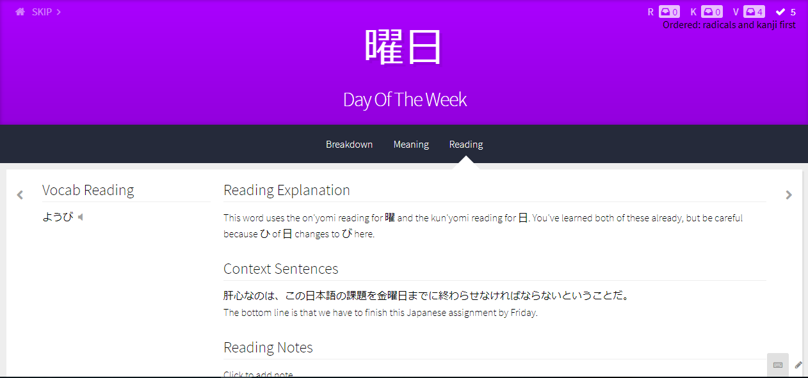
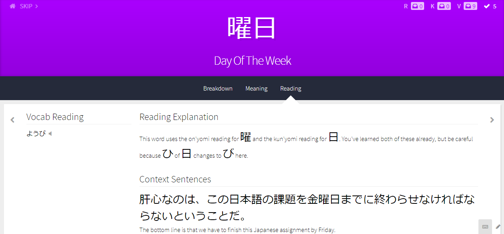
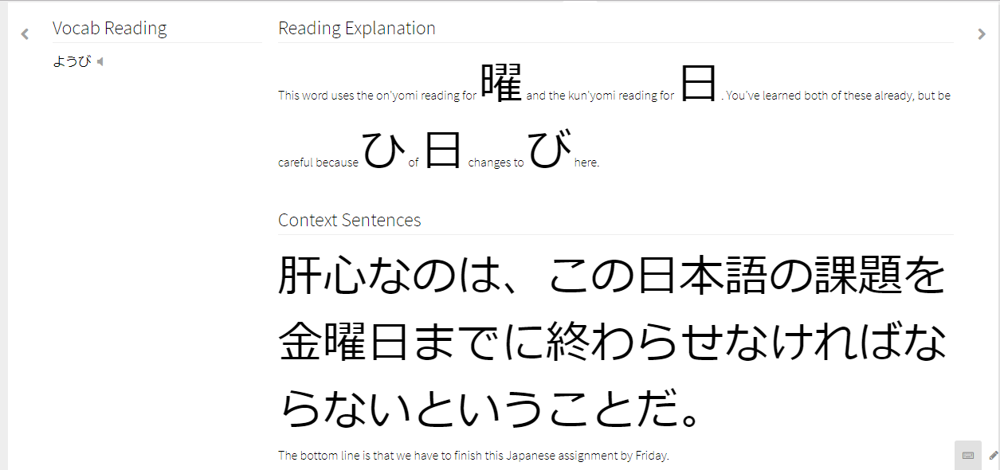

# WaniKani Japanese Font Enlarger

Automatically enlarges Japanese font on [WaniKani](https://www.wanikani.com). Press 'alt' + 'u' to enlarge Japanese font even more.

[More Info](INFO.md)

## Installation

In order to install and use this userscript you need to first install a browser extension/add-on such as Tampermonkey to manage it.

[Tampermonkey - Chrome](https://chrome.google.com/webstore/detail/tampermonkey/dhdgffkkebhmkfjojejmpbldmpobfkfo?hl=en)

[Tampermonkey - Firefox](https://addons.mozilla.org/en-US/firefox/addon/tampermonkey/)

The userscript can then be installed on the Greasy Fork [Installation Page](https://greasyfork.org/en/scripts/37995-wanikani-japanese-font-enlarger)

## Screenshots

### Lesson with Normal Font Size

### Lesson with Enlarged Font Size

### Lesson with Double Enlarged Font Size

## License & Copyright

© Mark Hennessy

Licensed under the [MIT License](LICENSE.md)
